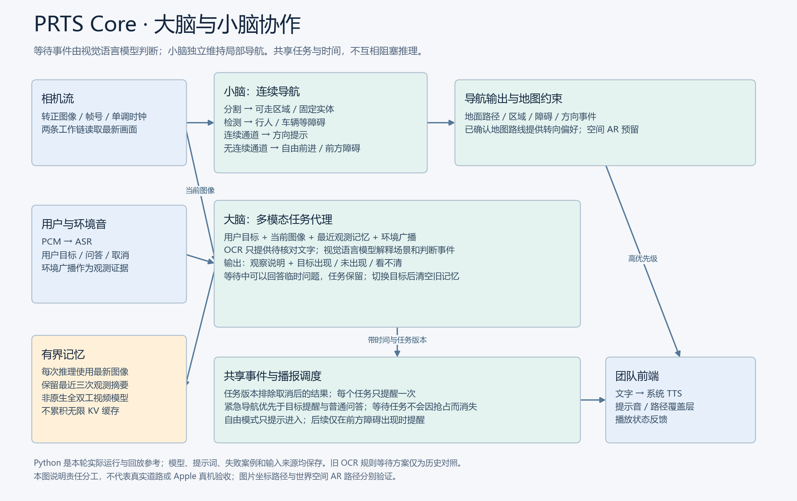

# PRTS Core

面向离线导盲研究的后端核心：相机帧与连续音频输入，输出导航事件、场景回答、等待目标提醒、TTS 文本和提示音指令。前端由团队独立开发。

当前阶段是可运行的 Windows/Python 快速原型，附带 C ABI 和 Swift 接入源码。**Apple 尚未编译或真机验证；动态公交提醒延迟和整套 8 GB 目标尚未达标。**

## Web 快速体验

[打开 GitHub Pages](https://oldcucumber.github.io/PRTS_Core/)：室内／街道示例、摄像头、本地视频，浏览器轻量地面分割、YOLO 障碍检测、自由前进提示、相对深度、TTS 和路线回放。大脑仅作为 Feature 展示，不加载 Qwen/MiniCPM；Web 轻量模型与桌面模型不同。详见 [Web 平台说明](docs/WEB_PLATFORM.md)。

## 从这里开始

- [本轮交接与下次工作](docs/HANDOFF.md)：当前状态、阻塞问题、代码入口与本机产物位置。
- [自由前进修订及模型比较](docs/REVISION_FREE_FORWARD.md)：当前行为、22 用例对比、连续公交成功与失败案例。
- [29 秒延迟分析](docs/LATENCY_ANALYSIS.md)：真实日志拆解及后续优化方向。
- [文档索引](docs/README.md)：区分当前接口与历史实验。
- [完整模型包使用说明](docs/BRAIN_BUNDLE_README.md)：ZIP 独立解压运行和 Apple 集成步骤。

## 系统分工

“小脑”使用 Mask2Former、YOLO 和图像空间路径规划，持续维护地面与障碍物观测。没有连续人行道时进入自由前进模式，仅提示一次进入，之后检测前向障碍。

“大脑”使用本地视觉语言模型理解图像和等待目标，处理公交、叫号、即时场景问答；OCR 仅提供待核对信息。当前选用 Qwen3-VL-4B Q4 语言 + Q8 视觉；MiniCPM-V 4.6 的同场景实测与取舍保留在修订报告。



## 工程目录

| 目录 | 用途 |
|---|---|
| `prts_core/` | Python 流式调度、任务状态、感知、地图与模型适配 |
| `native/` | llama.cpp 多模态 C ABI、便携几何及 ONNX 接口 |
| `apple/` | Swift Package、输入输出契约、Apple 接入源码 |
| `tests/` | Python 回归测试及既有浏览器测试 |
| `scripts/` | 模型准备、实验比较、回放、导出、打包和验证工具 |
| `docs/validation/20260922/` | 随 Git 保存的本轮模型结果与精简验证证据 |
| `licenses/` | 上游许可及模型卡 |
| `web/` | 既有浏览器地面识别原型，与本轮后端分开运行 |

`models/`、`outputs/`、`dist/`、虚拟环境、私有录音和本次新生成的大文件不随 Git 提交。历史仓库已经包含的浏览器 ONNX 和测试视频保持原状。当前完整权重与演示在本地交付 ZIP 中，因此仅克隆源码不能直接运行完整模型回放。

## 源码逻辑测试

Python 3.11：

```powershell
py -3.11 -m venv .venv
.venv/Scripts/python.exe -m pip install -r requirements-core-cpu.txt
.venv/Scripts/python.exe -m unittest discover -s tests -q
```

本轮在已安装 DirectML 依赖的 Windows 环境通过 63 项测试；以上为源码依赖安装入口，并未重新测试全新操作系统安装。CPU 与 DirectML 环境分别使用对应 requirements，不要混装两个 onnxruntime 包。逻辑测试不下载模型，完整感知与大脑回放按 ZIP 说明执行。

原生编译见 [native/README.md](native/README.md)，Apple 集成见 [APPLE_INTEGRATION](docs/APPLE_INTEGRATION.md)。模型、运行时和验证配置必须成组使用，不能把 CPU 数值直接当作 iPhone 性能。

## 历史原型

原始 Python 地面实验说明见 [LEGACY_FLOOR_NAV](docs/LEGACY_FLOOR_NAV.md)，浏览器启动、WebGPU 与既有 Pages 流程见 [WEB_README](WEB_README.md)。本轮不发布新的网页，也不新增前端功能。
