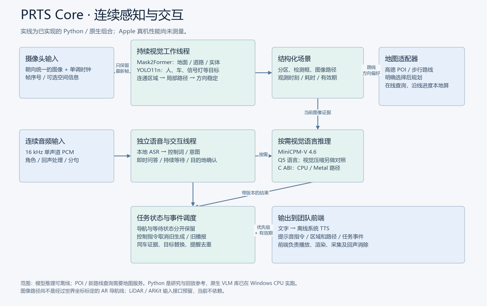
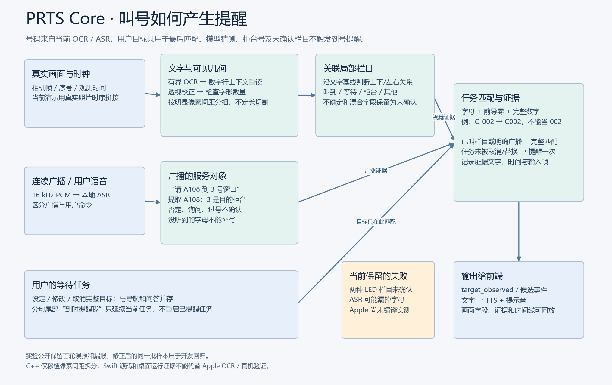
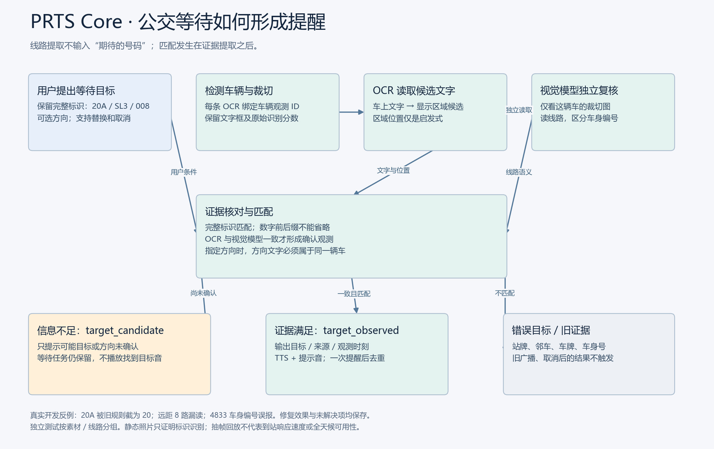
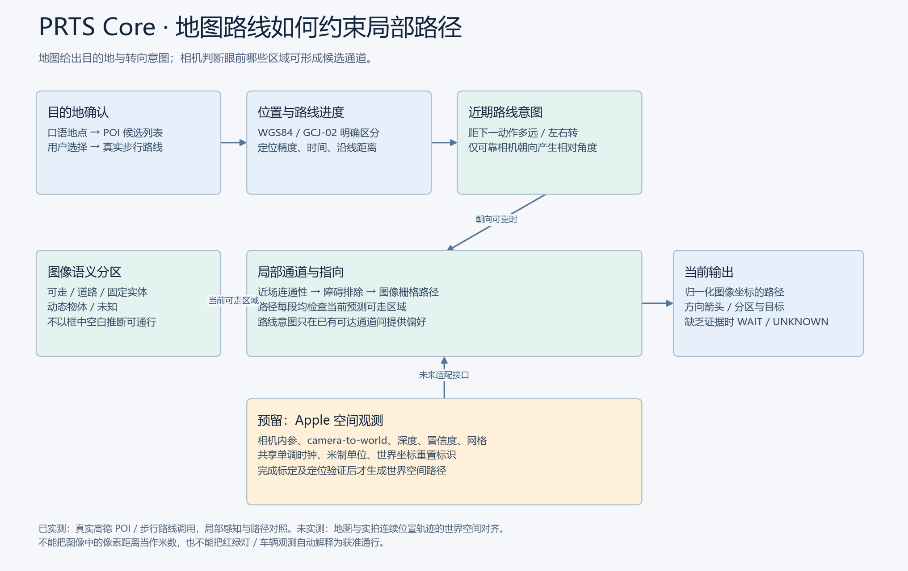

# PRTS Core 如何作出一次提示

核心把长期任务与短期观测分开。导航、等待某班车或某个号码是用户设定的状态；画面、车辆文字、广播和位置是带时间的证据。一次提示既要符合当前任务，也要能追溯到证据。

## 处理主线

相机输入持续更新最新帧槽。较重的语义分割负责地面、道路、墙体、植被等密集区域；检测器补充车辆和行人。局部规划仅在当前预测可走区域内寻找与近场相连的通道，再用 A* 连接局部目标。障碍和道路边界约束整段路径，时间平滑只能改善当前通道内的选择，不能放大可走区域。

方向先看近远路径走势，再结合连续画面的注册质量和滞回。可靠朝向与地图路线可以提供左右偏好。缺少近场、画面更新过慢或地图方向与可走通道冲突时输出 WAIT，并保留具体原因。

独立 CPU 路径中，等车用的轻量检测直接读取最新帧，不等待一次完整地面分割。语言模型按需读取证据帧；连续 PCM 由独立 ASR 工作者识别。长问答不会占住相机线程，用户的新命令可以取消旧答复。

## 叫号字段与广播

叫号需要先确定数字属于什么字段。OCR 保存实际字串和四角，局部重读尽量恢复模糊标题；对于粘连数字，仅根据可见字形与间距拆开。窗口编号不能借用相邻叫号标题的角色，未确认的栏目继续等待。广播则提取被叫对象，例如“请 A108 到 3 号窗口”中的 A108，排除目的柜台 3。用户目标只参与最后匹配，不补写模型遗漏的字母或号码。

语音分句产生的“到时提醒我”延续已有任务，保留已提醒状态；取消或明确新目标才改变等待。真实照片拼接与合成语音可展示这一后台过程，但不能充当现场排队过程或真实广播精度证据。首次误报和未解决的 LED 栏目见 [叫号验证](QUEUE_VALIDATION.md)。

## 等待任务与公交泛化

以“等 20A 路”为例，任务只保存完整目标 `20A`，不是“含有 20 的任意文本”。检测器先找到车辆，OCR 读取车辆内部文字。视觉模型在不知道用户目标号码的情况下独立读取线路显示屏，再与同车 OCR 核对。这样不因提示词包含期待答案而倾向回答该号码。

车身编号、站牌、邻车文字与线路屏是不同证据。前缀、后缀、前导零均保留；方向也必须来自同一车辆。如果只有一个读数或方向不足，发出候选提示并继续等待。匹配成功也只说明观察到目标，不自动给出过街、停车或登车许可。

真实测试曾出现 20A 被截成 20、4833 车身编号被当作线路，以及 8 路远距漏读。最新开发回归修复这些指定用例；新增照片中 101 成功、101X 漏报，首次结果原样保留。更强的 OCR 对不同排版有取舍，不能只修好一张图就替换全部模型。具体证据和数据分离方式见 [公交记录](BUS_GENERALIZATION.md)。

## 地图与地面路径

高德接口提供目的地候选和步行几何；用户确认后，位置更新映射到路线步骤，输出转弯、偏离或到达。地图给全局目标方向，当前相机约束眼前通道。GCJ02/WGS84 转换、真北朝向、图像坐标和 AR 局部世界坐标分别处理。

本机已有真实高德调用，但没有与该路线配套的现场相机/GPS。因而可以解释路线状态机和局部路径各自的实际结果，不能把不相关街景拼成已定位的 AR 导航。Apple 位姿、LiDAR 和网格已经预留入口，空间注册仍待对应素材及设备验证。

## 为什么选择分工

MiniCPM-V 负责复杂语言和视觉理解，地面/目标模型负责可检查的区域，ASR/TTS 负责音频接口。持续体验来自任务状态、并行调度和证据更新，并不要求每帧都让语言模型重新回答一次。当前组合是事件驱动的连续交互，不宣称原生全双工全模态。

可解释材料包括输入帧、分类区域、检测/OCR证据、路径、任务转换和耗时记录。这些是系统真实计算和使用的依据，不是编造的模型内部思考过程。

## 三分钟比赛讲解稿

“我们的系统叫 PRTS Core，是手机应用的后端核心。用户把手机固定在胸前，可以让它帮助观察人行道、询问告示内容，也可以要求持续等一班公交或一个叫号。

第一条处理链负责眼前的空间。我们把地面、道路、墙体、植被以及车辆行人分开，再找与近场相连的候选通道。路径必须留在当前可走区域内；画面变化或通道中断后，旧箭头会失效。

第二条处理链负责用户的意图。用户问一句话，系统可以查看最近的画面；用户说等某班车，任务会一直保留。画面更新与语音理解独立运行，用户也可以随时取消。

公交识别不能只看到了一个数字。我们先关联到具体车辆，再让 OCR 和视觉模型分别读取线路。视觉模型不知道用户期待的号码，避免顺着目标猜答案。我们也测试了字母线路、相似号码和车身编号。现在有成功案例，也保留远距仍不能确认的例子。

目的地导航则先确认地点，再使用真实地图路线。地图方向和眼前通道共同约束局部选择。当前演示会明确区分真实输入、仿真定位和还没有完成的空间对齐。

屏幕中的颜色、路径和时间线用来展示后台过程；实际用户主要听到简短语音与提示音。我们也在测完整运行时内存，并准备 Apple 的模型和音频桥接。最后的真机性能、空间注册和更复杂街道效果需要在同一套证据标准下继续验证。”
