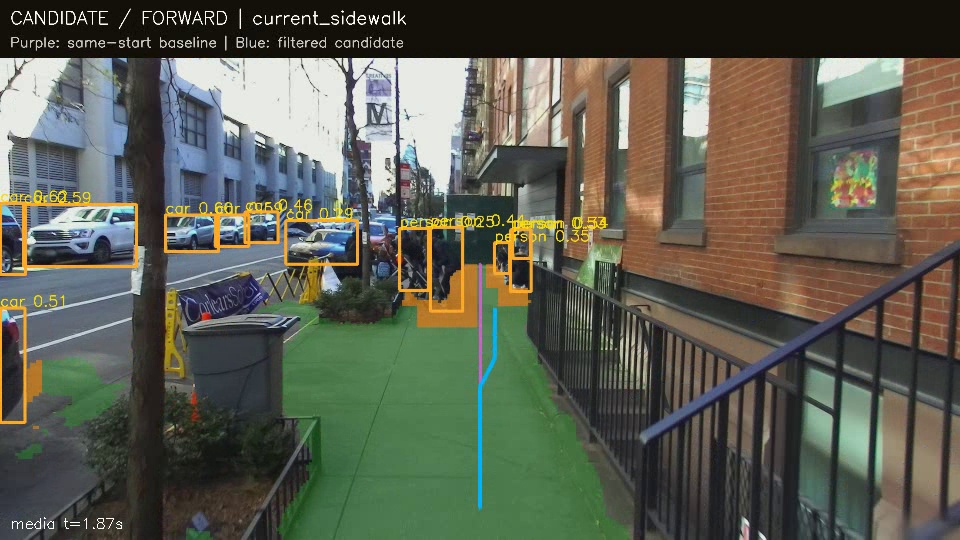
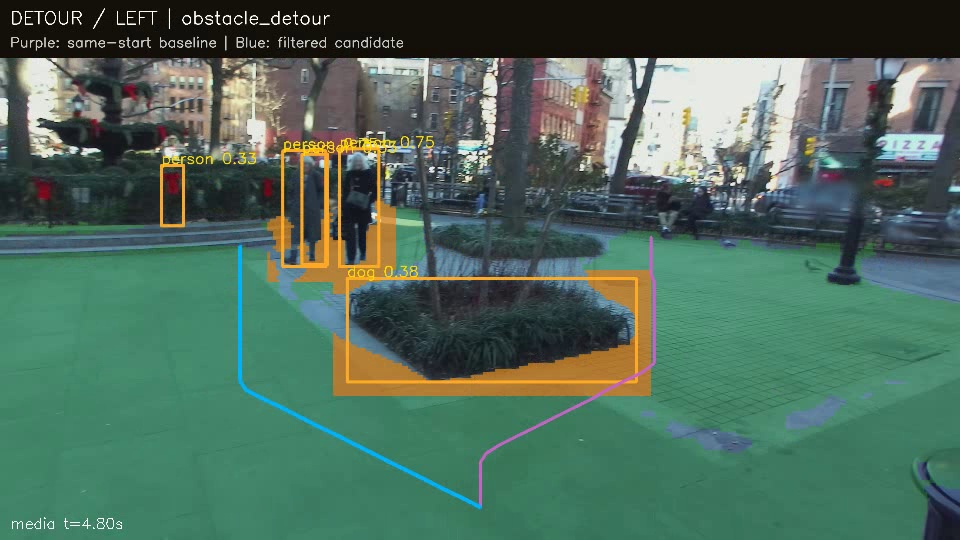
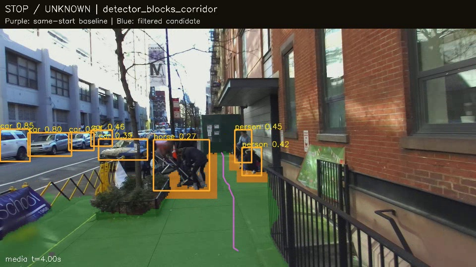

# PRTS Core Demo 验证记录

日期：2026-09-22。运行入口及复现命令见 [PRTS_CORE_README.md](../PRTS_CORE_README.md)。本轮交付为离线 Python 后端，完成普通人行道局部导航、障碍影响路径、中文录音问询三条演示链路，另接入公交和叫号持续等待。未新增前端，未修改原项目工作区，未提交、推送或部署。

## 导航和避障：完整片段

默认使用同一套 SegFormer-B4 Sidewalk、YOLO11n 与图像空间通道搜索。下表统计完整采样片段的输出，**不是准确率**；这些演示片段已经用于开发，不充当独立测试集。

| 回放 | 帧数 | 候选通道 | 障碍改变路径 | 阻断 | 不能确认 |
|---|---:|---:|---:|---:|---:|
| 城市人行道 | 21 | 11 | 6 | 3 | 1 |
| 公园入口障碍 | 20 | 10 | 2 | 1 | 7 |
| 消防栓附近人行道 | 45 | 23 | 0 | 0 | 22 |

候选通道包含前进和偏左/偏右。算法没有把所有帧输出成 STOP：同一近场起点下，比较仅分割与加入检测框的路径，检测确实改变可达通道才输出 DETOUR；若基线路径可用、加入障碍后被截断则输出 STOP。单纯分割不连续不会误记为障碍阻断；镜头突变或画面过期也会输出 WAIT。当前框不会沿用未经相机配准的旧检测框。

紫色是没有检测框过滤的基线，蓝色是过滤后路径，两者从同一近场锚点开始。第二张图中的花坛被检测器误分类为 `dog`，类别不正确；其实体区域仍参与了障碍过滤。它证明检测区域会改变路径，不能证明目标分类准确。第三张的停止也是对预测候选通道的判断，不等于真实世界不存在任何其他走法。

连续回放：[障碍视频 H.264 预览](../outputs/review/obstacles.mp4)、[导航原输出](../outputs/final-sidewalk/annotated.mp4)。预览仅转码，没有修改输入场景或拼接实时语音。公开帧来自 Waghmare 等人的 [SANPO](https://github.com/google-research-datasets/sanpo_dataset)，CC BY 4.0；这里增加了分割、检测、路径与状态叠加。会话分别为 `0xCqEk5hjEvrygxu26MZkieSv45D_gaJ`、`28tdwxgz-zPU06lpeDY3OPWTFxZyBv2c`、`0zEhKDk1j7KSuUQYR_rmCLmlbb5FCYG6`。

## 语音、场景与持续任务

| 输入与证据 | 实际结果 | 验证边界 |
|---|---|---|
| 真人录音询问所在位置 + 路牌画面 | 本地 ASR 后回答路牌所示“江夏大道”，导出中文 WAV | 根据可见路牌作答，没有 GPS 定位 |
| 真人录音读告示 | “温馨提示；校外车辆 / 禁止入校” | 按版面转写原文，不再扩写成相反的通行许可 |
| 真人录音等待公交 + 连续视频 | 创建 bus/912 任务，在媒体 22.0 秒读到车辆中的 912，提醒一次 | 9.0 秒开始观察；22 秒是首次系统命中时刻，不是人工标注的到站延迟 |
| 语音启动 → 询问障碍 → 停止 | 开始导航；描述前方中部行人、左侧树木/垃圾桶、右侧围栏；停止后不再发引导事件 | 输入语音由本地 Huihui 合成，画面来自真实公开步行视频 |
| 叫号广播 | A180 不触发 A108；9 秒正确广播触发；重复不再提醒 | 合成广播，真实医院/车站广播尚未验收 |
| 叫号屏幕与取消 | 10 秒正确屏幕触发；13 秒语音取消生效 | 合成屏幕和语音，不是现场叫号效果 |

原始结果在 `outputs/final-offline-road`、`final-notice`、`final-bus`、`final-voice`、`final-numbers-audio`、`final-numbers-visual`，各含 JSONL、summary、证据图和答复音频。[语音导航视频](../outputs/review/voice.mp4) 和 [对应答复音频清单](../outputs/final-voice/speech/manifest.json) 可直接核对。TTS **在回放后导出**，没有伪装成实时边说边听。

仍可观察到 ASR 错字：公交录音中的“路”被转写为“度”，但线路号与公交意图正确；路口录音中“路口”曾错成“路跑”。本轮没有用这些少量样例声称中文 ASR 准确率。领域提示不包含目标号码，没有针对 912/A108 写修词或触发分支。

场景问答初版被无关 OCR 横幅吸引，漏答行人；最终版把当前图像中、候选人行道附近的检测位置提供给视觉模型，已在同一帧复测并优先回答行人。更复杂场景的遗漏和幻觉仍可能发生。

## 检查与资源记录

- 核心逻辑回归 11/11；覆盖同起点绕行、禁止跳到远侧通道、分割断裂与障碍阻断区分、清除旧框、停止/问询语义、任务替换/取消、号码精确匹配、旧广播及重复提醒。
- 独立编写的 18 条文字意图用例，首次为 17/18；修正后实际运行规则与本地 Brain 回退为 18/18。它们现在是回归用例，不能继续称为未见过的盲测，也不是 ASR 测试。结果保存在 `outputs/intent-independent-final.json`。
- 原有 JavaScript 测试 15/15；Python 编译与 diff 空白检查通过。
- 9 组最终视频均完整解码；20 个答复 WAV 通过音频头与非空帧检查。所有有路径观测的实际路径、基线与锚点起点一致；4 秒停止指令后没有新增导航提示。
- `scripts/offline_smoke.py` 禁止 Python socket/DNS 连接后，实际完成真人录音 → ASR → 视觉问答 → WAV，退出码 0。首次检查发现 Ultralytics 的默认在线探测，已用其 `YOLO_OFFLINE` 开关关闭。此检查不是操作系统防火墙或原生库网络抓包。

环境是 Windows、i5-13600KF、32 GiB RAM、RTX 4070 SUPER 12 GiB、Python 3.11。以下是本次桌面回放观测值，含调度和预热影响，不是隔离基准；2fps 没有作为验收门槛。

| 处理范围 | 帧处理 p50 | p95 | 说明 |
|---|---:|---:|---|
| 城市人行道 | 179 ms | 209 ms | 分割、检测、通道搜索 |
| 公园入口 | 157 ms | 267 ms | 相同管线 |
| 消防栓片段 | 151 ms | 171 ms | 相同管线，仍有 22 帧 WAIT |
| 公交持续等待 | 1153 ms | 2654 ms | 加入整帧及车辆裁剪 OCR，不能套用纯导航速度 |

Whisper medium CPU 的这些短指令约需 4.5–5 秒识别；冷启动完整命令约 9–19 秒，包含首次载入 ASR/OCR/VLM，不能把逐帧导航耗时当语音响应延迟。视觉回答本身另记 `answer.processing_ms`。导航采样 RSS 约 1.7 GiB、PyTorch 显存峰值约 0.90 GiB；语音视觉组合采样 RSS 约 3.2–3.6 GiB、显存峰值约 3.4 GiB。RSS 是离散采样值，GPU 数值是 PyTorch 分配统计，不是整个进程的精确总峰值，也不是 iPhone 统一内存预算。[机器可读记录](demo_metrics.json) 保留每组测量及源码哈希。

## 分割训练试验与数据异常

保留了可运行的 SANPO 小样本适配脚本，但**没有将它设为默认模型**。最终训练仅用官方 `HUMAN_ANNOTATED` 帧：5 个训练会话 35 帧，1 个开发会话 7 帧，1 个独立测试会话 8 帧。早期试验把存在掩码误当作人工标签，混入了 `MACHINE_ANNOTATED` 帧；早期数字不作为最终验证依据。

开发集按“车道误纳入比例 ≤2%，再最大化地面 IoU”选择 step350：地面 IoU 0.483，车道误纳入 0.00372。这里是开发集 argmax 像素指标，样本很小，不能代表泛化准确率。

独立测试会话 `AdtGuq73TlhK5miUkWcUO9BoKdnmV-8j` 出现标签异常：首个人工帧的广场地面和建筑均含 class7，而官方 labelmap 定义 7 为 building；已核对 [官方 RGB 第一通道解码方式](https://github.com/google-research-datasets/sanpo_dataset/blob/main/sanpo_dataset/lib/tensorflow_dataset.py)。按原标签和运行阈值计算，B4 地面 IoU 约 0.000661，适配模型约 0.0000491。原分数保留在 `outputs/human-heldout-evaluation/metrics.json`，不擅自修标签，不选择性删除后宣称提升，也不能用这个异常测试证明默认 B4 的真实精度。

## 尚未验收的能力

当前仍是图像空间局部候选通道。消防栓片段约半数采样帧无法确认通道，公园长椅旁也会因分割漏地面产生过度停止。尚无独立、充分且质量可靠的分割/障碍/可行走路径真值集，不能声明导航安全率。

没有完成实体摄像头与麦克风现场联调、持续环境收音、唤醒/说话人区分、回声消除、语音打断、原生全双工、交通灯持续等待或安全过街判定。直播入口已实现最新帧替换、短期场景摘要、任务记忆，以及语言处理期间暂停引导；这些机制不能等同上述未验收能力。

没有在 Mac/Xcode/iPhone 上编译、签名或运行。C/Swift 桥接、模型转换、量化质量、热状态和统一内存峰值留待平台阶段；未集成的早期 C 草稿已移除。当前完整实现与模型接口在 `prts_core/`，不用未运行的 Apple 工程充当迁移成果。
