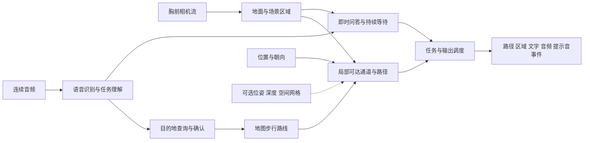

# PRTS Core 第二阶段计划：胸前导航、连续交互与 Apple 集成包

日期：2026-09-22。状态：**用户已设定第二阶段 goal，实施中。** 模型与数字预算是候选和验收目标，不是已经完成的结果。进度及证据见 [实施记录](PRTS_CORE_STAGE2_PROGRESS.md)。

## 1. 最终要得到的体验

手机固定在胸前，前端持续送入相机画面和音频。用户通过语音使用同一套后端，主要完成以下连续流程。

| 使用情境 | 预期行为 | 可以检查的结果 |
|---|---|---|
| 沿人行道行进 | 识别道路边界、可走区域和短时行进趋势，形成连贯的局部候选路线，输出直行、调整方向或等待提示 | 同一连续画面中的区域覆盖层、路径、方向及实际提示 |
| 前往目的地 | 理解目的地，给出有歧义的候选地点并确认；取得步行路线，随着行进更新转弯指令和局部路径 | 目的地确认记录、真实地图路线、位置与朝向记录、转弯时机和地面路径 |
| 途中观察 | 随时询问牌子或当前环境，标出墙壁、花坛、车辆、行人和信号灯等；保留正在进行的导航任务 | 原始帧、分类区域、文字/灯色证据、答复，以及问答后的任务状态 |
| 到站等车 | 到达指定候车位置后进入持续等待；匹配公交线路及方向，观察目标出现并提醒 | 从导航到等待的状态变化、车辆区域内的线路证据、一次有效提醒 |
| 其他等待 | 继续支持地铁和叫号等目标等待，允许修改、取消和恢复相关任务 | 正确目标、相似错误目标、取消和重复广播的回放记录 |

即时询问与持续等待仍是两种交互机制。导航是可以长期保持、被询问打断并恢复的任务，不按几段演示视频分别写死逻辑。

对用户的主要输出是简短语音和提示音；区域颜色与路径覆盖层用于前端呈现、开发验收和比赛讲解。当前阶段完成后端与集成接口，团队继续负责既有 Apple App 的界面。

信号灯颜色、车辆出现、可行走区域分别保留证据与时间。目标公交被识别出来时先报告目标及相对位置；安全过街、车门位置和允许登车不能由一个灯色或线路号码直接推出。精确测距、人体净空和 LiDAR 融合留到后续阶段。

## 2. 整体结构与前端契约



先冻结一份小而完整的接口规范，再让研究实现与手机运行层遵循相同语义。视频保留最新帧，音频保留有限时长连续缓冲；语言推理采用按需任务，及时的导航观测与提示具有优先级。取消和新的有效观测能使过时输出失效。这些是流式体验和内存控制必需的逻辑，不建设多用户服务、云端任务平台或复杂防御框架。

| 边界 | 计划约定 |
|---|---|
| 相机输入 | 帧时间戳、图像缓冲、尺寸、旋转和镜像信息；允许前端直接桥接像素缓冲，避免多次拷贝 |
| 音频输入 | 连续 PCM 音频块、采样率、声道、块序号及同一时钟下的起止时间；研究默认可使用 16 kHz 单声道，桥接负责格式转换 |
| 导航输入 | 位置、坐标系、定位精度、朝向及其精度；地图目的地选择、确认、取消等控制事件 |
| 后续可选输入 | 相机内参、相机到局部世界的位姿、跟踪质量、深度及置信度、地面/场景网格；携带单位、坐标系和时间戳 |
| 区域与路径输出 | 语义类别、原始模型类别、掩码或轮廓、候选路径、方向及证据帧；明确是图像坐标还是经过标定的局部空间坐标 |
| 文字输出 | 答复或引导文本、语言、播报优先级、有效期及取消关联，供前端离线 TTS 使用 |
| 可选音频输出 | 带序号和格式信息的原始音频块、结束与取消事件；仅在所选音频后端真实支持时启用 |
| 提示音输出 | 转弯、目标出现、需要等待等有限事件类型，由前端播放对应声音；避免与语音答复冲突 |

至少实现并验证一条连续输入到文字/TTS播放的完整链路。原始音频输出是可替换能力，不要求为支持它而强行常驻一个大型全模态模型。验证说话打断、提示优先级、用户命令与环境广播的区分，以及系统播报回授；回放结束后导出 WAV 不再代表流式链路验收完成。

LiDAR 和 Apple 空间识别本轮只预留接入契约，不作为启动依赖。可选数据缺失时继续给出当前能力范围内的图像空间候选路径，并明确缺少空间注册信息；不生成虚构的米制距离或世界坐标。

## 3. 地面、区域与路径的改进

### 感知选型

保留第一版作为基线，至少比较两种不同架构，并按同一批输入进行效果和导出验证。

| 候选路线 | 作用与取舍 |
|---|---|
| YOLO26 语义分割 + 按需实例分割 | 密集分类地面、道路、墙壁等，同时为行人和车辆提供物体轮廓；先比较小/中模型实际效果，不直接采用最大版本 |
| YOLOE 固定任务类别 | 比较文字或视觉提示对目标区域的帮助；导出前固定词表和提示嵌入，手机端无需常驻文本提示编码器 |
| 现有 SegFormer | 提供可复现基线，同时检查输入拉伸、分辨率和类别映射是否造成额外损失 |
| 更强的语义/分割模型 | Mask2Former 等可用于质量对照或辅助标注；只有效果、依赖和资源都过关，才进入运行方案 |

官方当前提供 YOLO26 的 Cityscapes/ADE20K 语义分割权重及导出方式；这是与普通实例分割不同的任务，不能把所有 `seg` 权重视为可用的地面模型。[YOLO 语义分割文档](https://docs.ultralytics.com/tasks/semantic)

YOLOE 的文字/视觉提示可以帮助扩展识别类别，但静态导出会固定类别；本计划不承诺导出后仍能随时改变提示词。[YOLOE 官方文档](https://docs.ultralytics.com/models/yoloe)

输出至少区分可走区域、车行/特殊通行区域、固定实体、动态物体和未知区域，并保留更细的原始类别。墙壁、花坛等用实际区域表达；仅识别为植被时保留“植被”的不确定性。悬空标志、树冠和地面实体需要结合位置/空间关系处理，不能把所有固定类别的整片投影都当作地面阻断。

### 路径与指向

先分清三个量：道路自身走向、胸前相机朝向、人的短时运动方向。检查镜头俯仰、摆动与转身；存在可靠位姿时使用位姿，没有时仅使用可验证的视觉估计并记录质量。

路径从当前近场可达位置出发，结合道路边界、连通区域、局部目标和地图转向选择候选通道。方向判断使用近远段走向和连续观测，增加合理的转向滞回；真实转弯、障碍进入与旧路径失效需要及时响应。平滑不能把路径画到墙壁、花坛、道路边界之外，也不能靠冻结箭头掩盖错误。

地图给出全局方向偏好，局部感知约束眼前通道。某条局部通道与目的地方向冲突时，产生等待、重新定位或重规划事件。位置误差、坐标转换误差、路径几何误差分别记录；高德坐标与设备定位坐标只在明确的边界转换一次。

“地面上有具体路径”分两级验证：第一步检查整段路径落在对应帧的可通行区域内；第二步在具有相机标定和可靠位姿/地面参考的序列上验证空间投影。仅画一条二维曲线不算真实 AR 空间对齐。Apple 位姿与深度接入后继续验证空间级结果。

## 4. 地图、问答与等待的串联

目的地流程为“语音解析 → 地点候选 → 用户确认 → 步行路线 → 路线进度 → 局部转向”。第一轮以一条可核查的国内步行短路线为主要实例，覆盖正常直行、至少一次转弯以及到站等待。

高德官方提供地点搜索和步行规划，可返回步骤、动作和路线点串；实际联调需要团队自己的 Web 服务 Key 及测试起终点。[地点搜索](https://developer.amap.com/api/webservice/guide/api-advanced/search)、[步行规划](https://developer.amap.com/api/webservice/guide/api/newroute)

本次尚未核实一个可直接使用的高德通用街景图像接口，不把它写成既有能力。地图演示优先结合真实路线与同一路段的现场视频/获准使用的街景；两者位置、行进方向和视点需有证据对应。街景承担环境参考，实时障碍判断仍使用当前画面。

模型推理保持本地；地图检索是可选的联网模块。离线时保留本地感知、问答和已有等待任务。新的目的地路线若缺少可用服务或获准使用的离线路网，就明确不可用；不承诺商业地图内容能任意缓存。

公交任务同时考虑线路号码、车辆区域、行驶方向或终点信息；将站牌线路号、反向车辆、路过不停车车辆和重复出现作为错误对照。信号灯需要区分行人/车辆灯与所对应的行进方向，无法确认关联时输出未知。读牌、叫号和即时问答继续用相同任务调度，不针对示范路线或目标号码写分支。

### 语言模型与流式交互选型

不预先锁定 MiniCPM-O，也不因为模型能够接收视频就认定它具有完整的实时交互能力。比较下面两条主要路线；选择依据是同一组中文语音、画面与连续任务的结果、响应时机、资源峰值和可移植性。

| 路线 | 原型如何工作 | 必须验证的取舍 |
|---|---|---|
| 视觉语言模型 + 独立语音识别/TTS | 感知层持续维护最新场景；用户询问或等待目标出现时选择证据帧，按需调用 MiniCPM-V 或其他小型视觉语言模型；输出分段文字，由前端播报 | 视觉更新与语言处理能否并行，旧答复能否取消，分段播报是否保留完整含义，是否漏掉短暂目标 |
| 原生流式全模态模型 | 对 MiniCPM-O 或其他具有可核查流式实现的模型验证连续音视频输入和音频/文字输出 | 中文效果、打断和回声处理、视觉编码/语音编码/语言主干/音频生成的各自占用，以及 Apple 或便携后端是否真正支持对应组件 |

第一条路线称为事件驱动的连续交互，不把逐帧独立问答包装成原生全双工。任务调度器只维护必要的导航、问答和等待状态；不为了“Agent”形式增加多层自主代理。

如果选择全模态路线，先逐组件测量，再测试语言主干低位宽、视觉/音频组件较高精度、关闭未使用音频生成等组合；只有模型结构和运行后端实际支持时才采用。两条路线都记录从用户说完话到首次有效回应、从目标出现到提醒、导航提示在问答期间的连续性。不为追求模型统一而牺牲地面识别效果。

Apple 的地理锚定依赖地区覆盖及网络，不能作为国内任何地点都可用的前提；本阶段先保留通用位姿接口。[Apple 地理跟踪说明](https://developer.apple.com/documentation/arkit/argeotrackingconfiguration)

## 5. 8 GB 预算与 Apple 迁移

暂按 **8 GB = 8,000,000,000 字节的整套应用预算**设计。核心争取不超过约 6 GB，另外约 2 GB 留给前端、音视频与平台额外开销。这是保守的初始分配，正式选型时根据实测调整，不能代表当前已经达标。

| 组成 | 初始预算上限 |
|---|---:|
| 地面/区域/目标感知及其临时激活 | 1.2 GB |
| 按需场景理解/语言模型、视觉编码及上下文缓存 | 2.8 GB |
| 语音识别、播报相关模型和缓冲 | 1.0 GB |
| 调度、图像队列、路线、共享运行开销 | 1.0 GB |
| 前端、平台开销与峰值余量 | 2.0 GB |

测量完整场景下的同时占用，覆盖冷启动、长时间导航、导航中问答、号码广播识别和连续播报。模型文件大小、进程常驻内存、独立显存、缓存和临时激活分别记录。桌面上内存与显存各自低于 8 GB 不算统一内存达标；保守合计只作迁移筛选，Apple 最终以实际进程 footprint 和设备可用额度验证。

先冻结效果基线，再依次尝试减少重复加载/拷贝、有限上下文、按需加载、FP16/INT8/更低位宽。每次压缩用相同输入检查边界、号码、否定文字、方向和任务结果，退化明显则回退。效果优先，2 FPS 不设为验收门槛；语音响应、提示时机和导航连续性仍须单独测量。

Python 用于研究、训练、回放与结果审计。手机包采用源码 Swift Package，桥接实际可运行的 Core ML、Metal 或便携 C/C++ 后端；CUDA 只是本机实验加速选项，运行方案不能强制依赖它或 TensorRT。

选定感知模型须实际导出，并用 ONNX Runtime CPU 对照原模型输出。Core ML 官方导出路径可在 macOS 或 x86 Linux 上执行；没有相应环境时明确记录未执行，不能把导出脚本算成转换成功，更不能算真机测试。[Ultralytics Core ML 导出](https://docs.ultralytics.com/integrations/coreml)

语音可比较便携的 Whisper 系列实现与更小中文模型；场景理解以当前 MiniCPM-V 为基线，也允许更换。移植必须核对具体模型版本、视觉编码器和量化格式，不仅核对家族名称。[whisper.cpp 的 CPU/Apple 支持](https://github.com/ggml-org/whisper.cpp)、[MiniCPM-V 官方应用](https://github.com/OpenBMB/MiniCPM-V-Apps)

Apple 的算子支持、算力利用、持续发热、并发音视频和延迟也是后续验收项。8 GB 是项目预算，不是系统保证分配给 App 的额度。[Apple 可用内存接口](https://developer.apple.com/documentation/os/os_proc_available_memory)、[热状态接口](https://developer.apple.com/documentation/foundation/processinfo/thermalstate-swift.property)

## 6. 数据与效果验收

建立按会话/街段分离的开发和验收集，冻结输入及来源。优先收集至少 12 段可连续检查的短片，覆盖胸前直行、弯道、墙壁/花坛、车辆/人流、遮挡和镜头摆动；语音另覆盖目的地确认、问答、取消及目标等待。根据公开数据实际可得性调整规模，并明确缺项。

SANPO 提供胸前/头部视角、标定、位姿和部分分割标签，可以支持研究；选择匹配相机的标注，并使用官方修正后的 `fixed_camera_poses.csv`。未经人工标注的胸前帧不能冒充有人工真值。已有标签异常先核对帧、相机、通道和类别表，再决定该样本能支持什么结论。[SANPO 官方数据说明](https://github.com/google-research-datasets/sanpo_dataset)

强模型辅助标注需标为伪标签，并通过独立素材和可检查区域复核；不得将模型自己的标签当作精度真值。真实、仿真、合成音频、人工标签和自动标签分开报告。已参与调参的演示片段不计入未见过的验收数据。

先比较预训练模型和输入/后处理修正；只有可靠标注上的误差显示需要领域适配时，再进行小规模微调或蒸馏。用户提供的四段视频用于还原交互需求与本地回归，默认不上传外部服务，也不将同一素材同时用于训练和独立验收。

训练采用明确允许相应用途的公开数据。Google Maps 平台内容的标准条款限制用于模型训练、测试或微调，因此不直接抓取 Google 街景来构建训练/评测集；若取得单独授权则按其范围处理。[Google Maps 条款](https://cloud.google.com/maps-platform/terms)

| 验收对象 | 方法与判断依据 |
|---|---|
| 地面与固定区域 | 对可靠标注计算分区 IoU、路面误纳入和边界误差；对无真值片段保留可视证据与具体失败，不能只比绿色面积 |
| 局部路径 | 检查整段路径及必要边界，而非几个采样点；统计穿越已知不可通行区域、通道中断和错误可达判断 |
| 指向 | 在已标明直行/转弯窗口的片段比较错误方向、短时反复切换与真实转弯响应；方向更稳定必须同时保持正确性 |
| 路线任务 | 同名目的地确认、错过转弯/偏离、导航中问答、恢复与取消；核对真实地图请求及其路线证据 |
| 持续等待 | 正确线路/号码和相似错误目标，区分站牌与车辆、方向、重复及取消；记录命中、误报、漏报与延迟 |
| 连续音视频 | 使用统一时间戳的完整流，至少一次连续 20 分钟运行，检验积压、打断、播报回授、过时提示和内存增长 |
| 可移植性 | 原模型与导出模型对照、CPU 实际推理、必需依赖与未支持算子记录；Apple 构建/真机状态单独列出 |

选型依据开发集，最终报告同时保留基线和新版本的完整结果。首轮量化基线后锁定精度/稳定性阈值，再运行独立验收；不能看到最终测试结果后再改通过标准。保留“只有单模型”“组合”“加入时序”三类必要对照，以确认提升来自哪里。

## 7. 实施顺序与每步交付

1. **冻结第一版和接口。** 保存现有结果，整理这次未验收草稿；写入音视频/任务/输出契约及可选空间接口，准备能模拟前端输入的流式回放器。
2. **改进感知与区域分类。** 建立胸前视角数据基线，比较候选模型、输入几何与掩码融合；对准备采用的候选提前做一次小规模 CPU/导出可行性检查，避免后期才发现平台障碍。交付逐帧对照、选型结论和已验证的运行路径。
3. **改进指向与路径。** 从正确的可达区域和运动趋势出发，处理转向稳定性、局部目标和地图方向约束，交付正常转弯及失败案例。
4. **串起任务。** 加入目的地确认、步行路线进度、实时问答、公交/叫号等待及语音/提示音调度，交付完整连续用例。
5. **压缩和移植验证。** 对整个组合实测峰值，逐项压缩并做效果回归；验证 CPU/ONNX 路径，完成能够在现有环境执行的 Apple 格式转换和桥接检查。
6. **打包与演示。** 用随包示例验证接口，生成可集成 ZIP、演示包、结果报告和比赛讲解材料；列明团队 Mac/Xcode 与真机尚需完成的检查。

步骤 1—3 不等待地图 Key 或 Apple 设备。真实地图联调在团队提供 Key 和测试位置后完成；缺少时先完成适配器与明确标注的契约回放，但该项仍保留“未真实联调”，不冒充真实路线演示。Apple 最终构建和应用内集成由拥有目标项目及 Mac/Xcode 的团队 agent 验证，成果状态必须回填。

## 8. 最终交付物

### 可集成 ZIP

拟交付 `PRTSCore-Integration.zip`，内容以可运行核心和可复现集成为主：

```text
PRTSCore-Integration/
  README.md                    能力、启动方法、已验证平台
  INTEGRATION_GUIDE.md          接入既有 Apple 工程的步骤和职责
  INTERFACE_SPEC.md             音视频、路径、任务、播报及空间接口
  Package.swift                源码 Swift Package 入口
  Sources/                     Swift 桥接与必要的便携核心代码
  Models/manifest.json         版本、哈希、许可、格式、输入输出、验证状态
  Tools/                       模型准备/导出与校验工具
  Examples/                    最小流式接入示例和小型合法测试素材
  Tests/                       接口与核心决策的必要回归
  reference/                   Python 研究与回放参考实现
  Reports/                     实测结果、资源、效果对照、剩余限制
```

权重在许可允许且体积合适时随包提供，否则附固定版本的获取及校验步骤。首次准备可联网，已准备好的模型推理离线。随包说明让团队 agent 找到现有相机、音频、TTS和渲染入口并逐项连接；记录目标平台、依赖版本及构建命令。没有在 Mac 上完成的构建不能标为通过，也不保证任意未知工程只拖入 ZIP 就能运行。

### 演示与比赛材料

- **沿路行进演示：** 胸前连续画面，展示地面边界、固定/动态区域、候选路径、指向和提示；同时提供第一版对照。
- **目的地导航演示：** 语音提出目的地、候选确认、真实步行路线、至少一个转弯和局部路径。地图路线与画面对应同一路段；仿真定位或位姿必须在视频和报告中标明。
- **到站等待演示：** 从导航任务切换到指定公交等待，展示线路/方向证据和提醒；即时问答及叫号用例作为补充。
- **处理过程录像：** 时间同步显示输入、区域识别、全局路线意图、局部路径、任务状态、文字/音频输出及阶段耗时。显示真实处理节奏；加速回放注明倍速。
- **讲解材料：** 一张处理流程图、一份约三分钟的比赛讲解稿、可复现用例说明、指标与失败案例表。解释模块如何共同形成决定，保留实际观察和决策依据；不把模型内部推理过程当作解释材料。

没有获得同一路段影像、真实路线凭据或可靠位姿时，分别交付已验证的部分并标出缺口。合成屏幕、配音和仿真轨迹可验证机制，不能代替真实效果证据。

## 9. 本次暂停点与后续 goal 描述

第一版已交付，见 [验证记录](PRTS_CORE_RESULTS.md)。第二版在这次“先计划”要求到达前，已保存第一版源码快照、下载两个候选权重、写入语义分区/模型加载草稿，并做过一帧强模型试验。完整多模型对照、路径修改、导出、8 GB 测量及集成包均未完成。强模型加载还出现需核查的分支提示；这批草稿不视为已验收。

制定计划时，执行任务确认没有正在运行的模型实验或下载；所有第一版 `final-*` 结果保留。用户随后正式设定第二阶段 goal，现已恢复实施；以上暂停记录作为历史起点保留。

可用于随后设定 goal 的目标描述：

> 依照 PRTS Core 第二阶段计划，将现有原型打磨为面向胸前相机与连续语音输入的可集成导航核心。优先提升地面/障碍区域识别和路径指向，完成目的地确认、地图路线与局部路径结合、途中问答、公交及叫号持续等待，并输出文字/TTS或音频、提示音和路径区域事件。以整套应用约 8 GB 工作集为预算，验证无需 NVIDIA 专属运行环境的部署路径，预留 Apple 位姿、深度和场景网格输入。交付源码 Swift Package 集成 ZIP、真实输入的完整演示与前后对照、资源和失败报告及比赛讲解材料。真实地图调用和 Apple 构建/真机实测以可用的团队凭据、目标项目和设备为条件，未验证部分明确记录，不以模拟结果替代。
